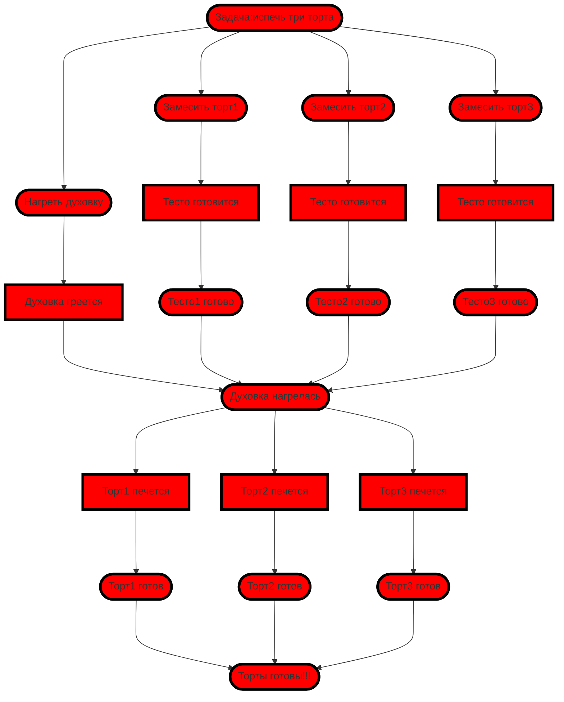

### Пекарь печет торты
- Асинхронность в действии. Выпечка тортов: реализация модели
### Условие:
- Тесто для тортов создается асинхронно.
- Духовка греется асинхронно
- Торты должны выпекаться в порядке готовности теста (синхронно)

